# Cakephp Notes

Author: Wei Liu

CakePHP Official Documentation：https://book.cakephp.org/5/en/index.html

## 1.Introduction to CakePHP

1. widely used in the industry 
2. integrated CRUD for database interaction (built-in classes that do this) built-in validation capabilities 
3. built-in helpers for AJAX, JavaScript, HTML forms 
4. built-in components for emailing, cookies, security and sessions 
5. the use of MVC forces an OO approach rather than embedding PHP scripts in HTML, making app cleaner
6. If conventions are followed, CakePHP has the ability to create the table and use it (bake) automatically


## 2.Download Software

`Windows`

1. [phpStorm Download](https://www.jetbrains.com/phpstorm/promo/?source=google&medium=cpc&campaign=APAC_en_AU_PhpStorm_Branded&term=phpstorm&content=604024580601&gad_source=1&gclid=CjwKCAjw17qvBhBrEiwA1rU9w8G9JVwwkOkVLV7Tod3w58CbXEiAHl2V0qQPcpuXi2oYDtH0jhSWPhoC6wwQAvD_BwE) 
2. [xampp](https://www.apachefriends.org/)(suite including Apache,MySQL,PHP) 
3. In **php.init**, find "extension=intl", remove the semicolon in front of the line (if there is one) and save the file 
4. restart apache server
5. install Visual C 2017 runtime from Microsoft: https://support.microsoft.com/en-au/help/2977003/the-latest-supported-visual-c-downloads
6. Install Composer: https://getcomposer.org/


`Mac`

1. [phpStorm Download](https://www.jetbrains.com/phpstorm/promo/?source=google&medium=cpc&campaign=APAC_en_AU_PhpStorm_Branded&term=phpstorm&content=604024580601&gad_source=1&gclid=CjwKCAjw17qvBhBrEiwA1rU9w8G9JVwwkOkVLV7Tod3w58CbXEiAHl2V0qQPcpuXi2oYDtH0jhSWPhoC6wwQAvD_BwE)

2. Php and MySQL download: check the **instruction video** from Wei

3. Find **php.ini** file location in terminal

   ```bash
   php -i | grep php.ini
   ```

4. Open that file in VS code, find "extension=intl", remove the semicolon in front of the line (if there is one) and save the file

5. restart apache server

6. Install Composer: https://getcomposer.org/


## 3.Download the Cakephp project

(Mac)find and enter the **www** folder, open the terminal

(Windows)In xampp, find and enter the **htdocs** folder, open the terminal

### 3.1 Download project

>Download from Github

For **developing** purpose

```bash
git clone https://github.com/wliu0025/phpreview.git
cd phpreview
composer install
```

If first time, build new repository in github+ clone + build cakephp (same name)+ add gitignore + push


> Download from local

For **learning** purpose, Create new Cakephp project

```bash
composer self-update && composer create-project cakephp/app <project_name>
# if Mac cannot run add sudo before this command
```


### 3.2 Start local server

(MAC)the server automatically runs once you download the environment

(Windows) Open xampp by clicking run as admin, start Apache and MySQL


>if cannot start,port issue,change the port 

https://stackoverflow.com/questions/18300377/how-to-solve-error-apache-shutdown-unexpectedly

>remove the process

https://stackoverflow.com/questions/39632667/how-do-i-remove-the-process-currently-using-a-port-on-localhost-in-windows

>Still cannot run

restart the computer + open xamppp as admin


### 3.3 Enter the database

(Windows)Click “Admin” directly and enter the phpmyadmin

(Mac)log in the local database to create a user in the Terminal 

```mysql
mysql -uroot
show databases;
create user 'superuser'@'%' Identified by 'password';
Grant all privileges on *.* to 'superuser'@'%' with grant option;
flush privileges;
exit;
```

Test initial database: http://127.0.0.1:8080/phpmyadmin/

give user name + password


> **app_local.php**: config database info to your local DB

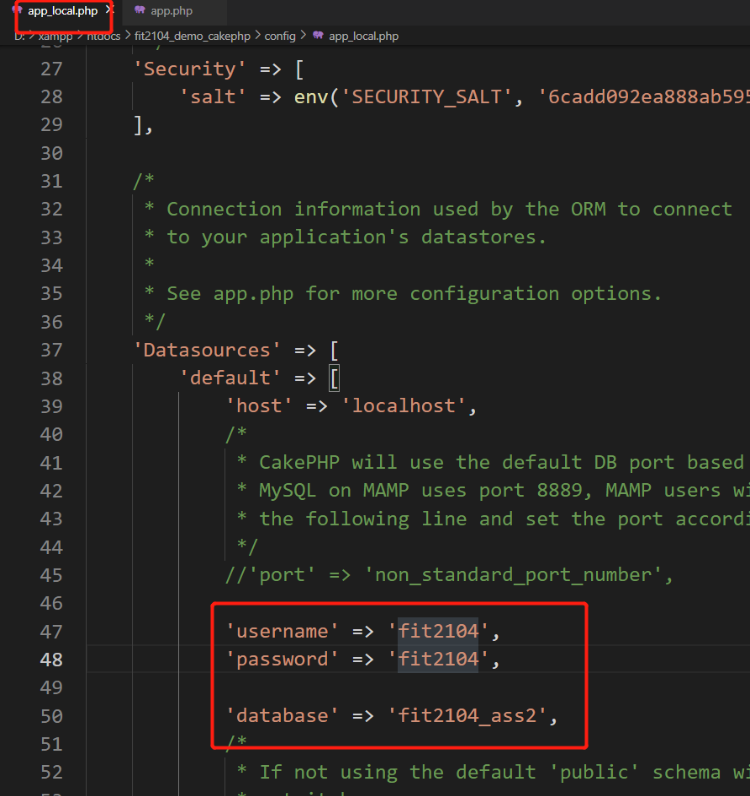

Test initial website: http://localhost:8080/<project_name>


## 4.Project structure

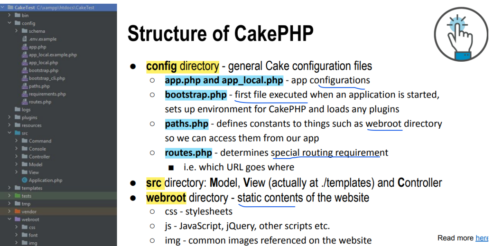


## 5. Database **Conventions**

following them can make your life a lot easier

- Database table names are plural, e.g. customers, children (yes, the real plural in English) 
- Relationship table names are underscored, eg. categories_products and in alphabetical order  
- PK to be called id and be auto_increment 
- FK to be called a singular table name followed by _id, e.g. customer_id in the orders table 
- Attribute with two or more words are underscored, e.g. first_name

>例子1：customers, orders,products

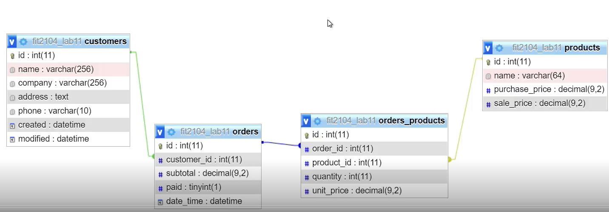


## 6.Bake the tables to generate codes

Aim of Baking: generate model, view,controller codes for us to make developing easier

Caution: **no need** bake the relationship table!!!


Under the root project directory

`Windows:`

```bash
bin\cake.bat bake all <table name>
```

`Mac:`

```bash
bin/cake bake all <table name>
```


> Change the schema,re-bake?

Bake is about code generator(model+view+controller). If you're just adding new columns in the database tables, re-bake might not be a good idea as it will **overwrite** whatever files it generates. That includes all of your changes to the code. You can simply study all of the generated files and add the missing columns accordingly.

Usually this involves the following changes:	

- Model (both entity and tables, as it defines how entities behaves in CakePHP)	
- View templates (as it contains the actual HTML forms that might need new fields)	

- Clear the database/schema cache from /tmp/cache as CakePHP caches database schema for better performance. Old cache will result in new columns being ignored when ORM is making queries

However if you know what you're doing and only re-baking some modules (for example, only controllers, only views or only model files) then re-bake can be a time saver. 


## 7.Deploy to aws

### 1.**EC2 instance:** bitnami lamp

https://www.youtube.com/watch?v=2ge0-YHAdlQ&ab_channel=TheKnowledgeKitten

https://www.youtube.com/watch?v=MDl5lSJWBg8&ab_channel=TheKnowledgeKitten


`SSH(remote log in aws server): `

AWS: security 添加22 SSH远程登录端口

```
ssh  -i "key3.pem" bitnami@13.211.137.41
cd htdocs
cd edupioneer
git pull
composer update
composer install
```


`Configure https`

https://docs.bitnami.com/aws/how-to/generate-install-lets-encrypt-ssl/

```shell
# Use The Bitnami HTTPS Configuration Tool
# 添加的时候不需要加http
sudo /opt/bitnami/bncert-tool

# Renew The Let’s Encrypt Certificate
sudo /opt/bitnami/ctlscript.sh stop
sudo /opt/bitnami/letsencrypt/lego --tls --email="EMAIL-ADDRESS" --domains="DOMAIN" --path="/opt/bitnami/letsencrypt" renew --days 90
sudo /opt/bitnami/ctlscript.sh start
```


### 2.Restart server

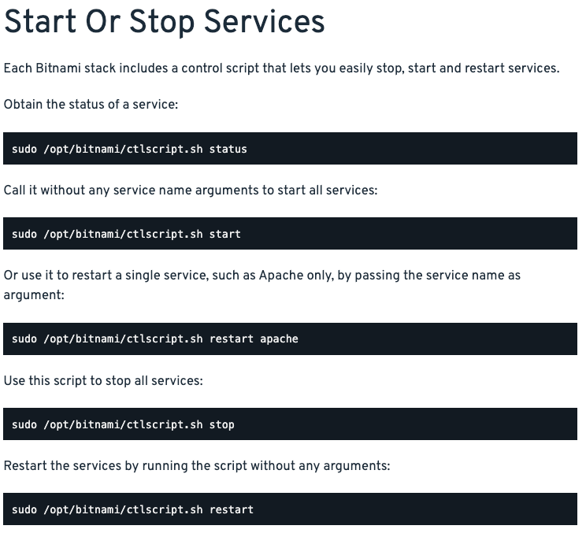


### 3.Git

`回滚到过去的commit`

```shell
git reflog
# Any changes made after the specified commit will be lost.
git reset --hard <commit-hash>
# only resets the commit history, but keeps all changes as staged in your working directory.
git reset --soft <commit-hash>

git push --force
```


## 8.Config 

`app.php`

1. Locale-sensitive: 设置当地时间

```php
'defaultLocale' => env('APP_DEFAULT_LOCALE', 'en_Au'),
'defaultTimezone' => env('APP_DEFAULT_TIMEZONE', 'Australia/Melbourne'),
```

2. 问题：出现 error和despetch提醒

```php
'Error' => [
  'errorLevel' => E_ALL & ~E_USER_DEPRECATED,
  'skipLog' => [],
  'log' => true,
  'trace' => true,
  'ignoredDeprecationPaths' => ['vendor/cakephp/cakephp/src/ORM/Table.php'],
],
```


`app_local.php`

1. set up database
2. 想要看见404页面,而不是抱错页面：

```php
'debug' => filter_var(env('DEBUG', false), FILTER_VALIDATE_BOOLEAN),
```


`bootstrap.php`: first file executed to set up environment + plugin

`paths.php`:define constants常量


`routes.php`: Define which url goes where

```php
$builder->connect('/', ['controller' => 'Bookings', 'action' => 'choose']);
```


## 9.Model

### 1.Entity

作用：Entities represent a single record in the database. Define fields in the table + individual functions

位置：像**src/Model/Entity/Article.php**


`自定义想显示的字段`

2 options

1. Change the index view

   ```php
   <td><?= h($publisher->first_name . ' ' . $publisher->last_name ) ?></td>
   ```

2. Virtual Fields： Create a function in Entity/Publisher.php

   ```php
   protected function _getFullName(){
     return $this->first_name . ' ' . $this->last_name;
   }
   ```

   in View

   ```php
   <td><?= h($publisher->full_name) ?></td>
   ```

   

### 2.Table

作用：provide access to the collection of entities stored in a table. Handles the definition of association, use of behaviors and verification of entities.

位置：像**src/Model/Table/ArticlesTable.php**


`Define some rules and associations`

>publisher -> many titles

PublishersTable.php

```php
// db table name
$this->setTable('publishers')
// this would be displayed in dropdown list when editing titles
 $this->setDisplayField('name')
```

TitlesTable.php

```php
$this->setDisplayField('title')
```


`Validations`

```php
$validator
   ->scalar('title')
   ->maxLength('title', 255)
   // title presence is required when addred a record
   ->requirePresence('title', 'create')
   ->notEmptyString('title','Please enter a value for the title field!');
```

Turn off broswer default validation (This field cannot be left empty)

```php
$this->Form->control('title',['novalidate'=>True]);
```

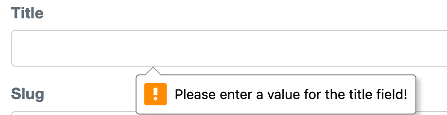


## 10.Controller

作用：handle HTTP requests and execute business logic contained in model methods, to prepare the response

### 1.取数据

>cake_cms例子
>
>user -> many articles
>
>many Articles <-> many tags

`1.得到对应的FK相关的数据(1个acticle对应的user)`

```php
$query = $this->Articles->find()->contain(['Users'])->all();
// $articles = $this->paginate($query);
```

```php
$article->user->email
```


`得到包含的多个数据(1个article有多个tags)`

```php
$article = $this->Articles->get($id, contain: ['Users', 'Tags']);
```

```php+HTML
$article->user->email
  
<?php foreach ($article->tags as $tag) : ?>
<tr>
  <td><?= h($tag->id) ?></td>
  <td><?= h($tag->title) ?></td>
  <td><?= h($tag->created) ?></td>
  <td><?= h($tag->modified) ?></td>
</tr>
<?php endforeach; ?>
```


`2.单独提取这1个article的所有的tags对象并传到view上(view页面)`

```php
$tags=$this->Articles->Tags -> find('list',order:'Tags.title'])->all();
```


`3.独立fetch一个表的数据`==表名一定要大写==

controller

```php
// 独立取他表数据
$allAvailabilities = $this->fetchTable('Availabilities')->find('all', order: 'Availabilities.booked_time ASC'
])->all();


// 计算total number of clients
$clients = $this->fetchTable('Clients')->find()>all();
$client_counts = $clients->count();
```

>find('all') vs find('list')

- find('all'): Used for fetching complete records. = find()
- find('list'): Used for fetching key-value pairs. dropdown list

>toArray() vs toList()

use `all()` collection of objects. count()

use `toArray()` when you need an associative array with original keys preserved. sizeof()

use `->all()->toList()` when you need a simple indexed array without caring about the keys from the original collection. sizeof()

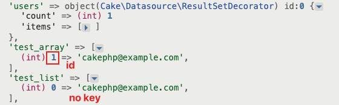

正常数组只能users[0]


`Edit改外键时,dropdown list显示排序的外键名字`

articles/edit.php

问题：we don't want to display the id  in the drop down list

```php
echo $this->Form->control('user_id', ['options' => $users]);
```

解决：

1. UsersTable.php

```php
 $this->setDisplayField('email');
```

2. controller/edit

```php
// 单独传外键的所有对象，为了view上dropdown显示所有
$publishers=$this->Titles->Publishers->find('list',['limit'=>200,'order'=>'Publishers.company_name'])
```


### 2.换layout

方法1:Controller

```php
//You can use this method to perform logic that needs to happen before each controller action.
public function beforeFilter(\Cake\Event\EventInterface $event)
{
  parent::beforeFilter($event);

  $this->viewBuilder()->setLayout('adminManageLayout');
}
```

方法2: View

```php
$this->layout = 'loggedin';
```


> Disable default layout

何时：return data in formats such as JSON or XML, or when you're building AJAX responses that do not require the HTML structure provided by a layout.

方法1: controller

```php
$this->viewBuilder()->setLayout(null);
```

方法2: View

```php
$this->disableAutoLayout();
```


>换view page(template)

```php
$this->viewBuilder()->setTemplate('messages');
```


### 3.post请求

```php
if ($this->request->is('post')) {
  $data = $this->request->getData();
  $data["email"]
}
```


### 4.get请求

```php
//方法1
$data = $this->request->getQuery();
$title = $data['title']
  
//方法2
$title = $this->request->getQuery('title');
```


### 5.Session存数据

原生php: $_SESSION

作用： enabling data persistence across the pages of an application. 服务器端跨页面保存读数据

`controller`

```php
$session = $this->request->getSession();

//write
$session->write('key', 'value');

//read
$value = $session->read('key');

//check exist
if ($session->check('key')) {
  // Key exists
} else {
  // Key does not exist
}

//delete
$session->delete('key');
```


`js`

- Use **sessionStorage** if you need the data to be available only while the browser is open and want it cleared automatically when the browser is closed.

```js
// Set session data
sessionStorage.setItem('username', 'JohnDoe');

// Get session data
let username = sessionStorage.getItem('username');
console.log(username); // Outputs: JohnDoe

// Remove session data
sessionStorage.removeItem('username');

// Clear all session data
sessionStorage.clear();
```

- Use **localStorage** if you need the data to persist beyond the current browser session and even after the browser is closed and reopened.

```js
// Set local storage data
localStorage.setItem('background', 'blue');

// Get local storage data
let background = localStorage.getItem('background');
console.log(background); // Outputs: blue

// Remove local storage data
localStorage.removeItem('background');

// Clear all local storage data
localStorage.clear();
```


## 11.View

### 1.view种类

The view layer in CakePHP can be made up of a number of different parts. Each part has different uses:

- **常规templates**: Templates are the part of the page that is unique to the action method being run. 
- **layouts**: template files that contain presentational code that wraps many interfaces in your application. Most views are rendered inside a layout.
- **helpers**: these classes encapsulate view logic that is needed in many places in the view layer. Among other things, helpers in CakePHP can help you build forms, build AJAX functionality, paginate model data, or serve RSS feeds.

- **elements**: small, reusable bits of view code. Elements are usually rendered inside views.

  1. 建Templates/element/links.php

  ```php
  //reuse 组件
  ```

  2. view

  ```php
  <?= $this->element('links'); ?>
  ```


- **cells**: these classes provide miniature controller-like features for creating self contained UI components. See the [View Cells](https://book.cakephp.org/5/en/views/cells.html) documentation for more information.

  1. bin/cake bake cell Inbox

  2. view: templates/cell/inbox/display.php

     ```php+HTML
     <div class="notification-icon">
         You have <?= $total_articles ?> articles.
     </div>
     ```

  3. Src/View/Cell/InboxCell.php

     ```php
     public function display()
     {
       $articles = $this->fetchTable('Articles')->find(contain:'Users')->all();
       $this->set('total_articles', $articles->count());
     }
     ```

  4. 使用

     ```php
     <?=$this->cell('Inbox')?>
     ```

     

### 2.常用代码

`view: h()`

```php+HTML
echo h("<h1>This is about us page</h1>");
echo "<h1>This is about us page</h1>"
```

h() is used as plain text, rather than being executed as code


`view: var_dump() and dump()`

var_dump() is for checking arrays and objects


`set title`

```php
$this->assign('title', 'Analysis Results');
```


`导入图片`

```php
<?= $this->Html->image('cake-logo.png') ?>
```


`Form添加class样式`

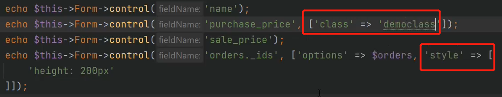


`导入css，js，写js代码`

```php
<?= $this->Html->css(['evo-calendar', 'booking'], ['block' => true]); ?>

  
<?= $this->Html->script('evo-calendar.min', ['block' => true]) ?>
<?php
$this->Html->scriptStart(['block' => 'script']);// Start a script block
?>

<?php
$this->Html->scriptEnd(); // End the script block
?>
```


`get controller name and action`

```php
$controller = $this->request->getParam('controller');
$action = $this->request->getParam('action');
```

```php+HTML
<a href="<?= $this->Url->build('/') ?>" class="<?= ($controller == 'Pages' && $action == 'home') ? 'active' : '' ?>">Home</a>
```


`css里面写background-image`

```css
background: url("/edupioneer/img/eud.webp") center center no-repeat;
background-size: cover;
```


### 3.Search

>Get request: search by name

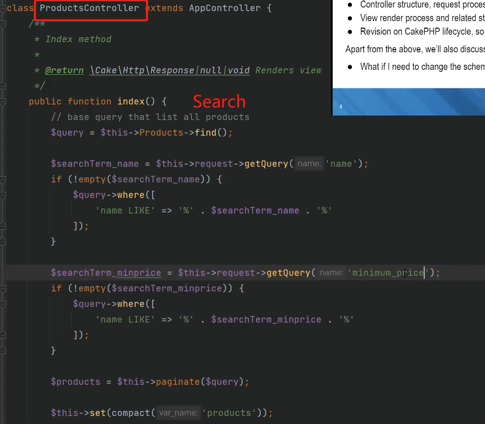

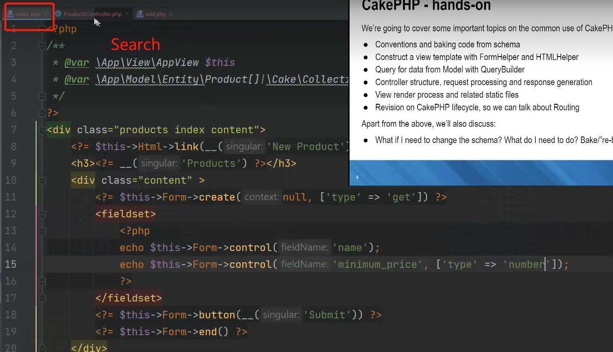


### 4.Dropdown list

>Get request: show a dropdown list and search for one

Controller:

```php
$query=$this->Records->find();
```

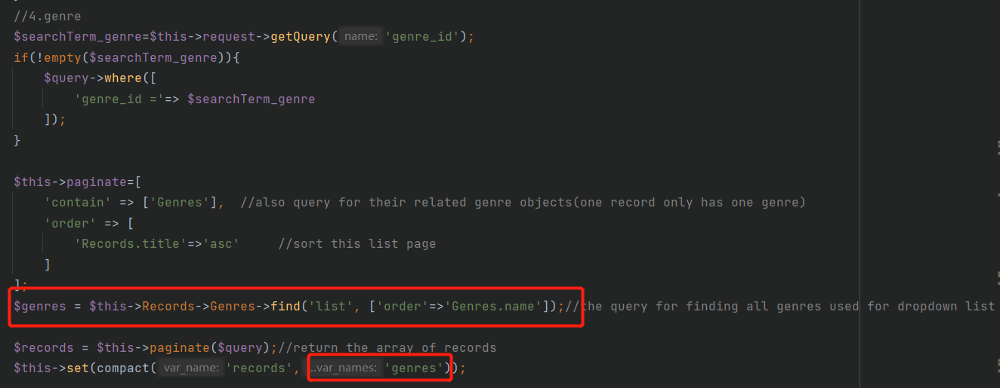

View:

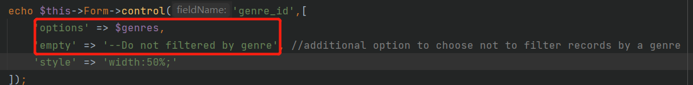


### 5. 遍历一组数据

```php+HTML
<?php foreach ($unemployments as $unemployment): ?>
<tr>
  <td><?= h($unemployment->date) ?></td>
  <td><?= $this->Number->format($unemployment->unemployment_rate) ?></td>
</tr>
<?php endforeach; ?>
```


## 12.Home + Default共享组件

1. **Home page**: src/Template/Pages/home.php + PagesController.php

   静态页面(**abutus,contactus**):  /Pages/aboutus 

3. **Default page**: src/Template/Layout/default.php

   Template:  header/menu/footer that will appear on every page

```php+HTML
<?php
$cakeDescription = 'PHPReview: review the cakephp';
?>
<!DOCTYPE html>
<html>
<head>
    <?= $this->Html->charset() ?>
    <meta name="viewport" content="width=device-width, initial-scale=1">
    <title>
        <?= $cakeDescription ?>:
        <?= $this->fetch('title') ?>
    </title>
  
  	<!-- webroot/favicon.ico -->
    <?= $this->Html->meta('icon') ?>
  
    <?= $this->Html->meta(
      'keywords',
      'enter any meta keyword here'
    );
    ?>

    <?= $this->Html->meta(
        'description',
        'enter any meta description here'
    );
    ?>

  	<!-- import css files -->
    <?= $this->Html->css(['normalize.min', 'milligram.min', 'fonts', 'cake']) ?>

    <?= $this->fetch('meta') ?>
    <?= $this->fetch('css') ?>
    <?= $this->fetch('script') ?>
</head>
<body>
    <nav class="top-nav">
        <div class="top-nav-title">
          <!-- /phpreview/ -->
            <a href="<?= $this->Url->build('/') ?>"><span>Cake</span>PHP</a>
        </div>
        
    </nav>
    <main class="main">
        <div class="container">
            <?= $this->Flash->render() ?>
            <?= $this->fetch('content') ?>
        </div>
    </main>
    <footer>
    </footer>
</body>
</html>
```

### 1.常用代码

>Icon

```php
<?= $this->Html->meta(
    'favicon.ico',
    '/favicon.ico',
    ['type' => 'icon']
); ?>
  
// http://localhost:8080/edupioneer/logo.png
<?= $this->Html->meta('icon', $this->Url->build('/logo.png', ['fullBase' => true])); ?>
```

>Title

```php
$this->assign('title', 'View Active Users');
```

>导入css，js,image

```php
<?= $this->Html->css(['bootstrap.min', 'bootstrap-icons/bootstrap-icons']) ?>
  
<?= $this->Html->script(['bootstrap.bundle.min', 'validate']); ?>
  
<?= $this->Html->image('hero-bg.jpg', ['alt' => 'A girl ready to plan her career']); ?>
```

>link导航

```php
<li><a href="<?= $this->Url->build('/pages/contact') ?>" class="active">contact</a></li>


echo $this->Html->link('Enter',
    '/pages/home',
    ['class' => 'button', 'target' => '_blank']
);
echo $this->Html->link('Dashboard',
    ['controller' => 'Pages', 'action' => 'home', '_full' => true]
);

<?= $this->Html->link(__('<i class="fas fa-fw fa-home"></i> Dashboard'), ['controller' => 'Admins', 'action' => 'dashboard'], ['class' => "nav-link", 'escape' => false]) ?>

```

主页

```php+HTML
<a href="<?= $this->Url->build('/') ?>">CakePHP</a>
<a href="<?= $this->Url->build(['controller'=>'Pages','action'=>'Home']) ?>">CakePHP</a>
```


><?= $this->fetch('css') ?>
><?= $this->fetch('script') ?>
>
>导入的是在具体page里的css,js

```php
<?= $this->Html->css(['evo-calendar', 'booking'], ['block' => true]); ?>

<?= $this->Html->script('evo-calendar.min', ['block' => true]) ?>
```


>jquery导入问题

方法一： 在default的header里导入

```php
<!-- Common jquery plugin -->
<?= $this->Html->script('jquery-3.7.1.min'); ?>
```

```html
<script>
	$( () => {
    $('.test').addClass('a');
  })
</script>
```

方法二(不推荐)：jquery正常导入，block=true

```php
<?php
$this->Html->scriptStart(['block' => 'script']);// Start a script block
?>
$( () => {
$('.test').addClass('a');
})
<?php
$this->Html->scriptEnd(); // End the script block
?>
```


>CSFR

```php
<?= $this->Html->meta('csrfToken', $this->request->getAttribute('csrfToken')); ?>
```

jquery

```js
var csrfToken = $('meta[name="csrfToken"]').attr('content');
```


### 2.Create new page

文件名：career_exploration

action名字：careerExploration


### 3.Create new folder

文件夹名：Careeers

文件名: index.php

建controller： CareersController.php

```php
<?php
declare(strict_types=1);
namespace App\Controller;

class CareersController extends AppController
{
  public function index()
  {
  }
}
```


### 4.Flash信息框

>原生css

```css
/* Flash messages */
:root{
  --color-message-success-bg: #e3fcec;
  --color-message-success-text: #1f9d55;
  --color-message-success-border: #51d88a;

  --color-message-warning-bg: #fffabc;
  --color-message-warning-text: #8d7b00;
  --color-message-warning-border: #d3b800;

  --color-message-error-bg: #fcebea;
  --color-message-error-text: #cc1f1a;
  --color-message-error-border: #ef5753;

  --color-message-info-bg: #eff8ff;
  --color-message-info-text: #2779bd;
  --color-message-info-border: #6cb2eb;
}


.message {
    padding: .5rem 1rem;
    background: var(--color-message-info-bg);
    color: var(--color-message-info-text);
    border-color: var(--color-message-info-border);
    border-width: 1px;
    border-style: solid;
    border-radius: 4px;
    margin-bottom: 1rem;
    cursor: pointer;
}
.message.hidden {
    display: none;
}
.message.success {
    background: var(--color-message-success-bg);
    color: var(--color-message-success-text);
    border-color: var(--color-message-success-border);
}
.message.warning {
    background: var(--color-message-warning-bg);
    color: var(--color-message-warning-text);
    border-color: var(--color-message-warning-border);
}
.message.error {
    background: var(--color-message-error-bg);
    color: var(--color-message-error-text);
    border-color: var(--color-message-error-border);
}
```

View

1. templates/element/flash/... 改class
2. 使用

```php
<?= $this->Flash->render() ?>
```

controller传

```php
$this->Flash->success(__(''));
$this->Flash->error(__(''));
$this->Flash->warning(__(''));
```

>简化

```css
.remindcard {
    font-family: 'Arial', sans-serif; 
    color: #333;
    background-color: #f9f9f9; /* 浅灰色背景，柔和不刺眼 */
    border-left: 5px solid var(--accent-color); /* 强调色边框 */
    padding: 10px 20px; /* 文字与边框的间距 */
    margin: 10px 0; /* 上下外边距，与其他元素的间隔 */
    border-radius: 5px; /* 圆角边框 */
    box-shadow: 0 2px 5px rgba(0, 0, 0, 0.1); /* 轻微的阴影效果 */
    text-align: left; /* 文字左对齐 */
    box-sizing: border-box; /* 边框盒模型 */
    width: calc(100% - 40px); /* 宽度减去padding确保布局不受影响 */
}
```


>bootstrap

alert alert-success


## 13.JSON 数据

### 1.js数据直接拿

```html
<script type="application/json" class="swiper-config">
{
  "loop": true,
  "speed": 600,
  "autoplay": {
    "delay": 5000
  },
  "slidesPerView": "auto",
  "pagination": {
    "el": ".swiper-pagination",
    "type": "bullets",
    "clickable": true
  },
  "breakpoints": {
    "320": {
      "slidesPerView": 1,
      "spaceBetween": 40
    },
    "1200": {
      "slidesPerView": 2,
      "spaceBetween": 20
    }
  }
}
</script>
```

```js
//js
function initSwiper() {
  document.querySelectorAll('.swiper').forEach(function(swiper) {
    let config = JSON.parse(swiper.querySelector('.swiper-config').innerHTML.trim());
    new Swiper(swiper, config);
  });
}
window.addEventListener('load', initSwiper);

//jquery
function initSwiper() {
  $('.swiper').each(function() {
    var swiper = $(this);
    var config = JSON.parse(swiper.find('.swiper-config').html().trim());
    new Swiper(swiper[0], config);
  });
}
$(window).on('load', initSwiper)
```


### 2.本地AJAX请求

View

```html
<div class="search-results" id="search-results"></div>
```

```js
$.ajax({
  url: "<?= $this->Url->build(['controller' => 'Occupationdescriptions', 'action' => 'searchResult']) ?>",
  type: 'GET',
  dataType: 'json',
  data: {
    anzsco_title: $('#anzsco-title').val(),
    industry_sector: $('#industry-sector').val()
  },
  headers: {
    'X-CSRF-Token': $('meta[name="csrfToken"]').attr('content')
  },
  success: function(response) {
    // Handle success
    console.log('Success:', response);
	},
  error: function(xhr, status, error) {
    // Handle error
    console.log('Error:', error);
	}
})
```

Controller

```php
public function beforeFilter(\Cake\Event\EventInterface $event) {
  parent::beforeFilter($event);
  if ($this->request->is('ajax')) {
    $this->viewBuilder()->setLayout(null);
  }
}

public function searchResult()
{

  $this->viewBuilder()->setLayout(null);

  if ($this->request->is('ajax')) {
    $queryData = $this->request->getQuery();
    
    // Process data
    $occupations = null;
    .....
    
    // Send response
    if(empty($occupations)){
      return $this->response->withType('application/json')
        ->withStringBody(json_encode(['result'=>'no result']));
    }else{
      return $this->response->withType('application/json')
        ->withStringBody(json_encode($occupations));
    }
}
```


### 3.Json数据文件

#### 1.动态数据(API)

何时：需要的带特定数据结构的json数据

1. routes.php

   ```php
   $builder->setExtensions(['json', 'xml']);
   ```

2. 向 /bookings/calendar.json 发送请求

   ```php
   <?= $this->Url->build(['controller'=>'Bookings','action'=>'calendar','_ext'=>'json']) ?>
   ```

3. Controller: pass data
4. 整理数据：templates/Bookings/json文件夹/calendar.php

```php
$data=[];
$item=[1];
$data[]=$item;


<?php
$data = array_map(function($booking) {
    return [
        'title' => implode('|', [$booking->booked_time, $booking->name, $booking->service, $booking->location]),
        'start' => $booking->date,
        'id'    => $booking->id,
    ];
}, $bookings);
echo json_encode($data);
```

>Objects of array vs arrays of array

```php
// Assuming $people is an array of Person objects
foreach ($people as $person) {
    echo "Name: " . $person->name . ", Age: " . $person->age . PHP_EOL;
}


$data = [
    ['name' => 'Alice', 'age' => 30],
    ['name' => 'Bob', 'age' => 25],
];

$people = [];
foreach ($data as $item) {
    $people[] = new Person($item['name'], $item['age']);
}

var_dump($people);
```


#### 2.静态的

放在webroot文件夹下

```php
// Assuming your JSON file is named 'data.json' and located in the webroot directory
$jsonFilePath = WWW_ROOT . 'data.json';

// Check if the file exists
if (file_exists($jsonFilePath)) {
    // Read the file content
    $jsonContent = file_get_contents($jsonFilePath);
    
    // Decode the JSON content into a PHP array
    $dataArray = json_decode($jsonContent, true);
    
    // If you want an object instead of an array, you can omit the second parameter:
    // $dataObject = json_decode($jsonContent);

} else {
    // Handle the error, file not found
    echo "JSON file not found.";
}

```


### 4.第三方API


## 14.CSS经验

`某个元素vertical center`

```css
.vertical-center{
    position: relative; /* Set position to relative */
    top: 50%; /* Move element down by 50% of parent container's height */
    transform: translateY(-50%);
}
```


`某个text颜色渐变`

```css
h1 {
  font-size: 60px; /* Large font size to enhance the effect */
  background: -webkit-linear-gradient(left, #ff7e5f, #feb47b); /* Define your gradient */
  -webkit-background-clip: text; /* Clip to the text */
  color: transparent; /* Make the text color transparent */
  background-clip: text; /* Standard syntax, for future-proofing */
  -webkit-text-fill-color: transparent; /* For webkit browsers */
}
```


`背景是视频`

```html
<!DOCTYPE html>
<html lang="en">

<head>
    <meta charset="UTF-8">
    <meta name="viewport" content="width=device-width, initial-scale=1.0">
    <title>Document</title>
    <style>
        *,
        ::after,
        ::before {
            box-sizing: border-box;
            margin: 0 auto;
            padding: 0;
        }

        .hero {
            --default-color: #ffffff;
            --default-color-rgb: 255, 255, 255;
            --background-color: #000000;
            --background-color-rgb: 0, 0, 0;
            --heading-color: #ffffff;
            width: 100%;
            min-height: 80vh;
            position: relative;
            padding: 80px 0;
            display: flex;
            align-items: center;
            justify-content: center;
            color: var(--default-color);
        }

        .hero:before {
            content: "";
            background: rgba(var(--background-color-rgb), 0.4);
            position: absolute;
            inset: 0;
            z-index: 2;
        }

        .hero video {
            position: absolute;
            inset: 0;
            display: block;
            width: 100%;
            height: 100%;
            object-fit: cover;
            z-index: 1;
        }

        .hero .content {
              position: relative;
              z-index: 3;
              text-align: center;
          }
    </style>
</head>

<body>
    <div class="hero">
        <video playsinline autoplay muted loop>
            <source src="banner_video1.mp4" type="video/mp4">
        </video>

        <div class="content">
            <h1>Welcome to Our Website</h1>
            <p>This is a great place to introduce your company.</p>
        </div>
    </div>

</body>

</html>
```


`内部元素居中`

1.内部元素有width

2.外面div：d-flex ,justify-content-center


`css grid animation`

```html
<div class="grid">
  <div class="grid-item"></div>
  <div class="grid-item"></div>
  <div class="grid-item"></div>
  <div class="grid-item"></div>
  <div class="grid-item"></div>
  <div class="grid-item"></div>
  <div class="grid-item"></div>
  <div class="grid-item"></div>
  <div class="grid-item"></div>
  <div class="grid-item"></div>
</div>

<script src="https://cdn.jsdelivr.net/npm/animate-css-grid@1.3.0/dist/main.min.js"></script>
<script>
	const gridContainer = document.querySelector('.grid');

  const animateOptions = {
    duration: 600,
    easing: 'backInOut'
  }
  animateCSSGrid.wrapGrid(gridContainer, animateOptions)
  
  $(".grid-item").click(function() {
    $(this).toggleClass('expanded');
    $(".grid-item").not(this).removeClass('expanded')
  })
  
</script>
```

```css
/* Grid */
.grid {
  margin-top: 50px;
  display: grid;
  grid-template-columns: repeat(auto-fit, minmax(200px, 1fr));
  grid-gap: 10px;
}
.grid > .grid-item {
  min-height: 200px;
  width: 100%;
  background: darkviolet;
}
/* transtion */
.grid-item.expanded {
  grid-column-end: span 2;
  grid-row-end: span 2;
}
```


`<select>颜色`

```css
.form-select{
    color:rgba(var(--default-color-rgb), 0.3);
}
```

```js
$('#ANZSCO_Title1').change(function () {
  //change color
  $(this).addClass('text-dark')
});
```


`fontawesome 6`

```html
<link rel="stylesheet" href="https://cdnjs.cloudflare.com/ajax/libs/font-awesome/6.5.2/css/all.min.css" integrity="sha512-SnH5WK+bZxgPHs44uWIX+LLJAJ9/2PkPKZ5QiAj6Ta86w+fsb2TkcmfRyVX3pBnMFcV7oQPJkl9QevSCWr3W6A==" crossorigin="anonymous" referrerpolicy="no-referrer" />
```


`提示Note组件`

```css
.remindcard {
    font-family: 'Arial', sans-serif; /* 使用通用字体提升兼容性 */
    color: #333; /* 深色文字提升可读性 */
    background-color: #f9f9f9; /* 浅灰色背景，柔和不刺眼 */
    border-left: 5px solid #ff4500; /* 强调色边框 */
    padding: 10px 20px; /* 文字与边框的间距 */
    margin: 10px 0; /* 上下外边距，与其他元素的间隔 */
    border-radius: 5px; /* 圆角边框 */
    box-shadow: 0 2px 5px rgba(0, 0, 0, 0.1); /* 轻微的阴影效果 */
    text-align: left; /* 文字左对齐 */
    box-sizing: border-box; /* 边框盒模型 */
    width: calc(100% - 40px); /* 宽度减去padding确保布局不受影响 */
}
```


`bg颜色`

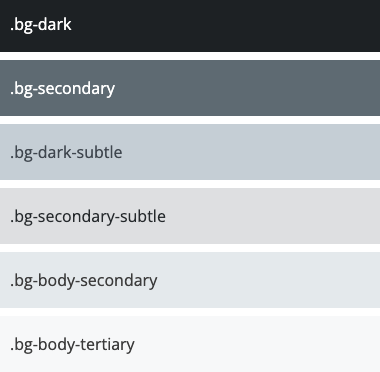


## 15.JS经验

`导航到某个div元素`

Js

```js
const offset = 100;
const elementPosition = document.getElementById('search-results').getBoundingClientRect().top + window.pageYOffset;

window.scrollTo({
top: elementPosition - offset,
behavior: 'smooth'
});
```

jquery

```js
// Check if the target element exists
if ($targetElement.length) {
    // Calculate the position to scroll to
    var scrollToPosition = $targetElement.offset().top;

    // Animate the scroll to the target element
    $('html, body').animate({
        scrollTop: scrollToPosition
    }, 1000); 
} else {
    console.log("Element not found with pie-chart-to-block=" + pointName);
}

```


`添加一个a tag到一个div里main`

```js
console.log($("#targetElement").html()) //内部
console.log($("#targetElement").prop('outerHTML')) //自己


//js
var id = "https://example.com";
var link = document.createElement("a");
link.href = id;
link.textContent = "Click Here";
console.log(link.outerHTML)


//jquery
var newLink = $('<a>', {
  text: 'Click me', // Text displayed in the link
  href: '#', // URL to link to
  click: function(event) {
    alert('You clicked the link!');
    event.preventDefault(); // Prevent default action of the link
  }
});
console.log(newLink.prop('outerHTML'))
```


`jquery 事件+ 点击到顶部`

```html
  <a href="#" id="scroll-top" class="scroll-top d-flex align-items-center justify-content-center"><i class="bi bi-arrow-up-short"></i></a>
```


```css
.scroll-top {
  position: fixed;
  visibility: hidden;
  opacity: 0;
  right: 15px;
  bottom: -15px;
  z-index: 99999;
  background-color: #5fcf80;
  width: 44px;
  height: 44px;
  border-radius: 50px;
  transition: all 0.4s;
}

.scroll-top i {
  font-size: 24px;
  color: #ffffff;
  line-height: 0;
}

.scroll-top:hover {
  background-color: rgba(95, 207, 128, 0.8);
  color: #ffffff;
}

.scroll-top.active {
  visibility: visible;
  opacity: 1;
  bottom: 15px;
}
```


```js
let scrollTop = document.querySelector('#scroll-top');
// 显示按钮
function toggleScrollTop() {
  if (scrollTop) {
    window.scrollY > 100 ? scrollTop.classList.add('active') : scrollTop.classList.remove('active');
  }
}
// 点击事件
scrollTop.addEventListener('click', (e) => {
  e.preventDefault();
  window.scrollTo({
    top: 0,
    behavior: 'smooth'
  });
}); 

window.addEventListener('load', toggleScrollTop);
document.addEventListener('scroll', toggleScrollTop);
```

Or

```js
let scrollTop = $('#scroll-top');
// 显示按钮
function toggleScrollTop() {
  if (scrollTop) {
    window.scrollY > 100 ? scrollTop.classList.add('active') : scrollTop.classList.remove('active');
  }
}
// 点击事件
$('#scrollTop').on('click', function(e) {
    e.preventDefault();
    $('html, body').animate({
        scrollTop: 0
    }, 'smooth');
});

$(window).on('load', toggleScrollTop);
$(window).on('scroll', toggleScrollTop);
```


`w-100 vs w-auto`

**w-auto** depends on the size of the content within the element. If the content size changes, the width of the element also changes. **w-100**, on the other hand, does not depend on content size but rather matches the width of its parent container.

https://getbootstrap.com/docs/5.3/utilities/sizing/

```html
<!DOCTYPE html>
<html lang="en">
<head>
<meta charset="UTF-8">
<title>Width Examples</title>
<style>
    .w-auto { width: auto; background-color: lightblue; margin: 10px; padding: 10px; }
    .w-100 { width: 100%; background-color: lightcoral; margin: 10px; padding: 10px; }
    .container { width: 50%; border: 1px solid black; padding: 10px; }
</style>
</head>
<body>

<div class="container">
    <div class="w-auto">This box takes up as much width as its content needs.</div>
    <div class="w-100">This box stretches to fill the width of its container.</div>
</div>

</body>
</html>
```

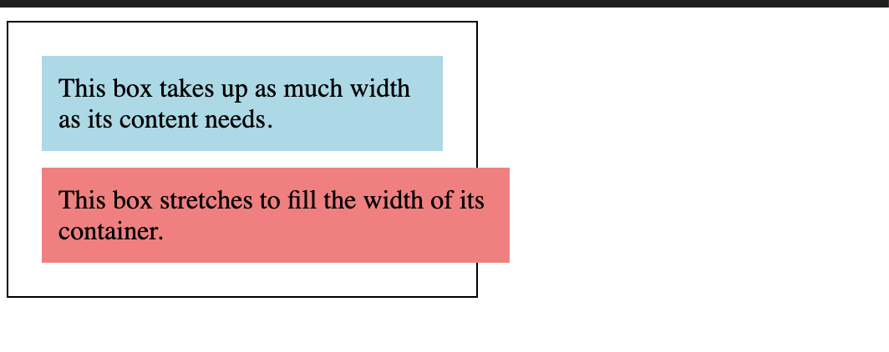


## 16.js和php数据交换

`js数据放到html上`

```js
var item=`<div>
<h3><a href="<?= $this->Url->build(['action'=>'detail']) ?>/${job.id}">${job.ANZSCO_Title}</a></h3>
<p>${job.ANZSCO_Description}</p>
</div>`
$(".search-results").append(item)
```


`Php array to js array`

```php+HTML
var unemploymentRates = <?=
json_encode(array_map(function($unemployment) {
    return round((float)$unemployment->unemployment_rate,1);
}, $unemployments->toArray())); ?>
console.log(unemploymentRates)
```

```php
<?php
    //level 1
    foreach (array_keys($listofcluster) as $familys){
        echo '{';
        echo 'name: "'.$familys.'",';
        echo 'id: "'.$familys.'",';
        echo 'data: [';
        foreach (array_keys($listofcluster[$familys]) as $clusters){
            $temp = 0;
            foreach ($listofcluster[$familys][$clusters] as $tasks){
                $temp = $temp + $tasks[1];
            }
            echo '{';
            echo 'name: "'.$clusters.'",';
            echo 'y: '.$temp.',';
            echo 'drilldown: "'.$clusters.'"';
            echo '},';
        }
        echo ']';
        echo '},';
    }
?>
```


## 17.发email

`sendGrid`

1. 获得api key

2. 设置一下sender authentication，到aws domain里面添加records

3. 配置single sender: info@edupioneer.com


`app.php`

```php
'sendgrid' => [
  'className' => 'Smtp',
  'host' => 'smtp.sendgrid.net',
  'port' => 587,
  'username' => 'apikey',
  'password' => '', # api key
  'tls' => true,
  'client' => null,
  'timeout' => 30,
],
```

```php
'Email' => [
  'default' => [
    'transport' => 'sendgrid',
    'from' => 'info@edupioneer.com.au',
  ],
],
```


`controller`

```php
use Cake\Mailer\Mailer;

if ($this->request->is('post')) {

  //get post data
  $email = $this->request->getData();

  // 1.Send email to client who made a booking
  $mailer = new Mailer();
  // Setup email parameters
  $mailer
    ->setEmailFormat('html')
    ->setTo($email['email'])
    ->setFrom("info@edupioneer.com.au",'EduPioneer')
    ->setSubject('Confirmation of your message' . " <" . h($email['subject']) . ">")
    ->viewBuilder()
    ->disableAutoLayout()
    ->setTemplate('contact');

  // Send data to the email template
  $mailer->setViewVars([
    'subject' => $email['subject'],
    'client_name' => $email['client_name'],
    'email' => $email['email'],
    'message' => $email['message'],
  ]);
  //Send email
  $email_result = $mailer->deliver();
  if ($email_result) {
    $success_info = 'Thank you for contacting us and confirm information in your email.';
    $this->set(compact('success_info'));
  } else {
    $fail_info = 'Email failed to send.';
    $this->set(compact('fail_info'));
  }
}
```


`Templates/email/html`里建contact.php模版

注意：图片用静态服务器host


## 18.reCaptcha

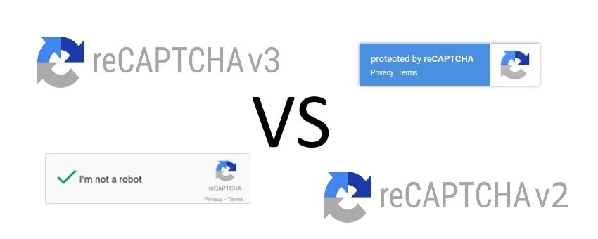

>V2: tick box

`paths.php`

```php
define('RECAPTCHAV2_SITEKEY', '');
define('RECAPTCHAV2_SECRET', '');
```

`contact.php`

```php+HTML
<div id="form_recaptcha"></div>
<?= $this->Flash->render() ?>

<button type="submit" >Send Message</button>


<script src="https://www.google.com/recaptcha/api.js?onload=onloadCallback&render=explicit" async defer></script>
<script>
    var onloadCallback = function () {
        grecaptcha.render('form_recaptcha', {
            'sitekey': "<?=RECAPTCHAV2_SITEKEY?>",
        });
    };
</script>
```

`controller`

```php
private function __checkRecaptchaResponse($response)
    {
        // verifying the response is done through a request to this URL
        $url = 'https://www.google.com/recaptcha/api/siteverify';
        // The API request has three parameters (last one is optional)
        $data = array('secret' => RECAPTCHAV2_SECRET,
            'response' => $response,
            'remoteip' => $_SERVER['REMOTE_ADDR']);

        // use key 'http' even if you send the request to https://...
        $options = array(
            'http' => array(
                'header' => "Content-type: application/x-www-form-urlencoded\r\n",
                'method' => 'POST',
                'content' => http_build_query($data),
            ),
        );

        // We could also use curl to send the API request
        $context = stream_context_create($options);
        $json_result = file_get_contents($url, false, $context);
        $result = json_decode($json_result);
        return $result->success;
    }
```

```php
$email = $this->request->getData();

if ($this->__checkRecaptchaResponse($email['g-recaptcha-response'])) {
		.....
}else {
	$this->Flash->error('Robot verification failed,you are a robot');
}
```


>v3

`paths.php`

```php
define('RECAPTCHAV3_SITEKEY', '');
define('RECAPTCHAV3_SECRET', '');
```

`contact.php`

```html
<script src="https://www.google.com/recaptcha/api.js?render=<?=RECAPTCHAV3_SITEKEY?>"></script>

<script>
  	grecaptcha.ready(function () {
            grecaptcha.execute('<?=RECAPTCHAV3_SITEKEY?>', {action: 'submit'}).then(function (token) {
                // Add your logic to submit to your backend server here.
                $(".php-email-form").append(`<input type="hidden" name="g-recaptcha-response" value="${token}">`);
            });
        });
</script>
```

`controller`

注意：同上，改__checkRecaptchaResponse参数


## 19.Accessibility

userway: https://manage.userway.org/widget/my-sites/p/1

```html
<script src="https://cdn.userway.org/widget.js" data-account="du7FseHoVd"></script>
```


## 20.Chatbot

Tidio chatbot: https://www.tidio.com/panel/settings/live-chat/appearance

```html
<script src="//code.tidio.co/s3zqscnhvxny5337qsm05vzd79ouicnq.js" async></script>
```

flow是用来设置机器人的
